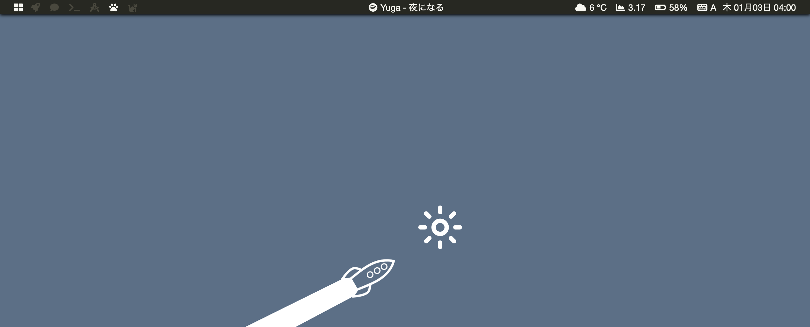

# Bar

Bar is an  [Übersicht](https://github.com/felixhageloh/uebersicht) widget
that places a customizable bar on your desktop.



## Elements
*from Left to Right, in the same order:*

- chunkwm: Tilling mode (first icon)
- chunkwm: Current active desktop (next 6 icons, number of icons changes according to current number of active desktops)
- Currently playing music from Spotify
- Weather of current location
- Load average
- Battery
- Current active input
- Date/Time


## Requirements

- nodeJS (`brew install node`)

## Installation

1. Clone this repo to your Übersicht widgets directory.

```bash
$ git clone https://github.com/adwinying/bar $HOME/Library/Application\ Support/Übersicht/widgets
```

2. Download required dependencies:

```bash
$ cd $HOME/Library/Application\ Support/Übersicht/widgets/bar
$ npm install
```

3. Create a custom config file (custom configs go here):

```bash
$ cp lib/custom.js.example lib/custom.js
```

## Space configuration
It's possible to get chunkwm to update when spaces are switched. You can
use the following in your `~/.skhdrc`.
```
cmd - 1 : khd -p "cmd + alt - 1" && uberrefresh Workspace
...
```

`uberrefresh` is a shell script included in this repository. Symlink it to
`/usr/local/bin`
```bash
$ ln -s scripts/refresh.sh /usr/local/bin
$ mv /usr/local/bin/refresh.sh /usr/local/bin/uberrefresh
```

## Questions?

If you find a bug or have any questions about Bar, [submit an issue](https://github.com/adwinying/bar/issues/new).

